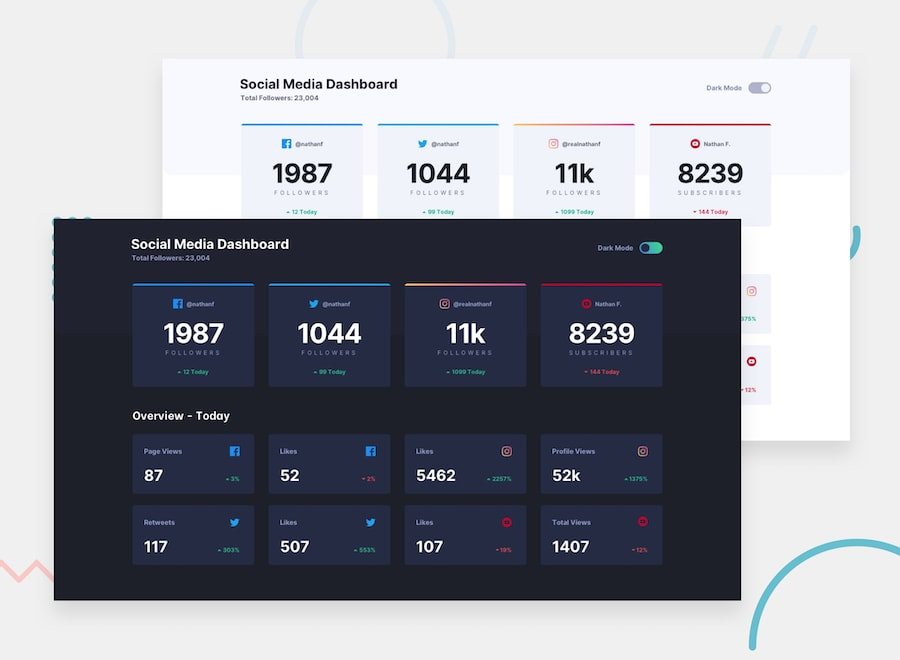
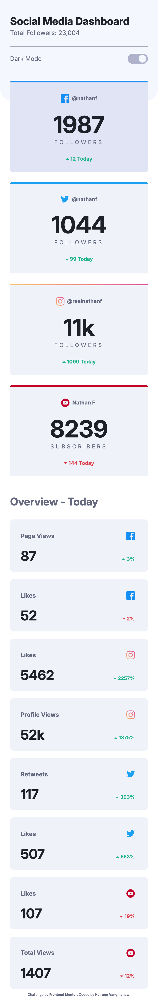
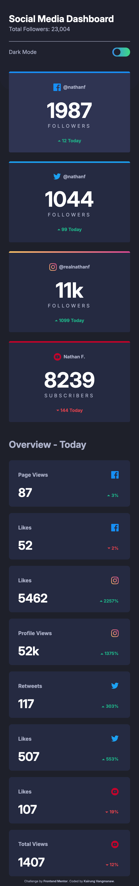
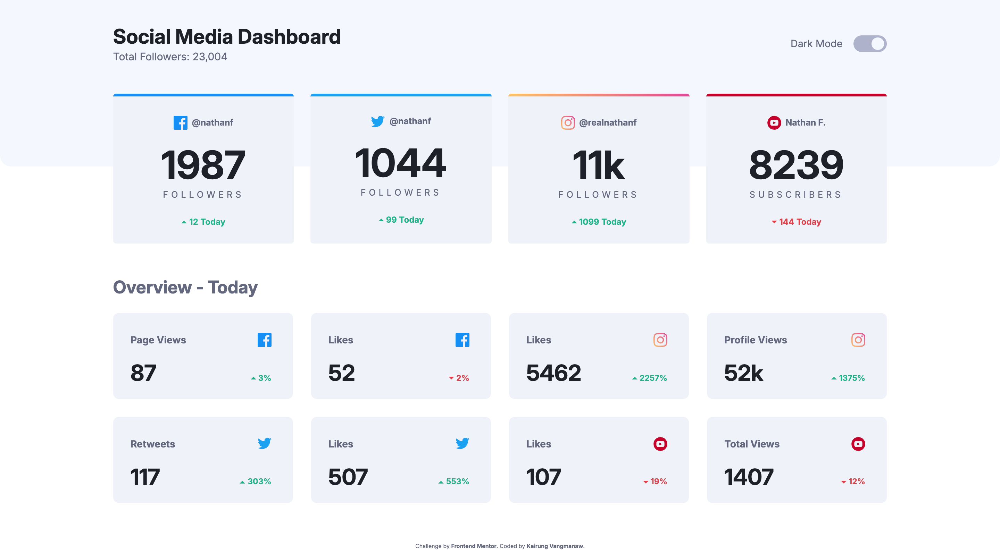
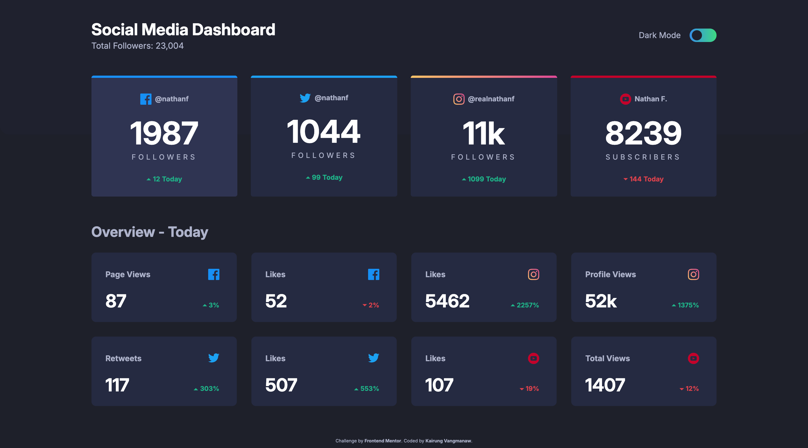
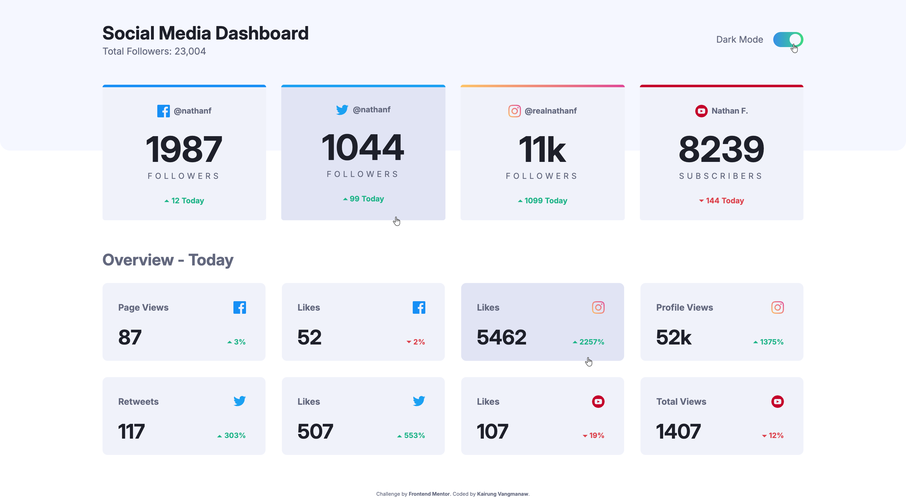
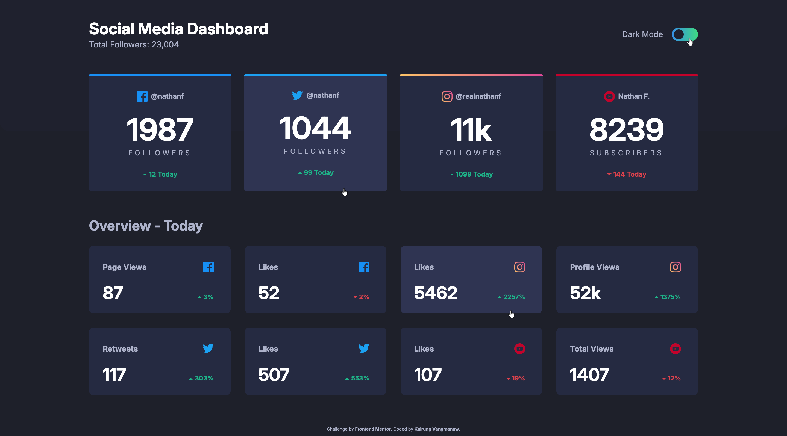

# Frontend Mentor - Social media dashboard with theme switcher 



This is a solution to the [Social media dashboard with theme switcher challenge on Frontend Mentor](https://www.frontendmentor.io/challenges/social-media-dashboard-with-theme-switcher-6oY8ozp_H). Frontend Mentor challenges help you improve your coding skills by building realistic projects. 

## Table of contents

- [Frontend Mentor - Social media dashboard with theme switcher](#frontend-mentor---social-media-dashboard-with-theme-switcher)
  - [Table of contents](#table-of-contents)
  - [Overview](#overview)
    - [The challenge](#the-challenge)
    - [Screenshot](#screenshot)
    - [Links](#links)
  - [My process](#my-process)
    - [Built with](#built-with)
    - [What I learned](#what-i-learned)
    - [Continued development](#continued-development)
    - [Useful resources](#useful-resources)
    - [AI Collaboration](#ai-collaboration)
  - [Author](#author)
  - [Acknowledgments](#acknowledgments)

## Overview

### The challenge

Users should be able to:

- View the optimal layout for the site depending on their device's screen size
- See hover states for all interactive elements on the page
- Toggle color theme to their preference

### Screenshot

<details>
  <summary>Mobile view</summary>
  
</details>

<details>
  <summary>Mobile view</summary>
  
</details>

<details>
  <summary>Desktop view</summary>
  
</details>

<details>
  <summary>Desktop view</summary>
  
</details>

<details>
  <summary>Active state view</summary>
  
</details>

<details>
  <summary>Active state view</summary>
  
</details>

### Links

- Solution URL: [Social Media Dashboard – React, Vite, BEM & Custom HSL Theme Switcher](https://www.frontendmentor.io/solutions/social-media-dashboard-react-vite-bem-and-custom-hsl-theme-switcher-BgA8FtBmXC)
- Live Site URL: [Frontend Mentor | Social Media Dashboard With Theme Switcher](https://challenged-by-frontend-mentor.github.io/social-media-dashboard-with-theme-switcher/)

## My process

### Built with

- Semantic HTML5 markup
- CSS Custom Properties (Variables)
- CSS Flexbox & CSS Grid
- Mobile-first workflow
- Responsive typography and padding (using `clamp()` and `dvh`)
- [BEM Methodology](https://www.google.com/search?q=https://en.bem.info/methodology/) - CSS class naming convention
- [React](https://reactjs.org/) - JS library
- [Vite](https://vitejs.dev/) - Frontend Tooling
- Accessibility (a11y) best practices - Keyboard navigation and focus states

### What I learned

Throughout this project, I deepened my knowledge in both CSS architectural techniques and JavaScript data formatting:

1. **Relative Color Syntax (`hsl(from ...)`):**
   Learned how to derive hover states directly from CSS custom properties using relative color syntax, allowing seamless light/dark mode variations without duplicating color variables.

   ```css
   .highlight__card:hover {
     background-color: hsl(from var(--clr-card-bg) h s var(--clr-card-bg-hover-light));
   }
   ```

2. **Accessible Outline Offset** (`outline-offset`):
   Utilized `outline-offset` alongside `:focus-visible` to create visually distinct focus indicators with a clean gap between the element boundary and outline.

3. **Number Formatting with** `toLocaleString()`:
   Leveraged JavaScript's `Number.prototype.toLocaleString()` to automatically format raw follower and engagement numbers into localized string representations with thousand separators (e.g., `10480` $\rightarrow$ `10,480`).

4. **Custom Accessible Toggle Switch**:
   Constructed a pure CSS toggle switch overlaying a hidden `<input type="checkbox">` element, ensuring accessible keyboard focus via `:has(:focus-visible)` while maintaining full visual customization.

5. **Theme Management with** `data-theme`:
   Implemented theme switching logic using a `data-theme` attribute attached to the root document, allowing global color variable swapping across light and dark modes effortlessly.

6. **Gradient Borders**:
   Explored techniques for multi-color gradient top borders (such as Instagram's brand gradient) using pseudo-elements (`::before`) and absolute positioning.


### Continued development

For future iterations or similar dashboard projects, I plan to expand upon the following areas:

- **Live Social Media API Integration**: Connect the dashboard components to live third-party APIs (e.g., YouTube Data API, Meta Graph API) or real-time mock web sockets to fetch dynamic engagement statistics dynamically.

- **Enhanced Keyboard Navigation & ARIA Live Regions**: Add live region announcements (`aria-live`) when toggling themes or updating data to improve screen reader accessibility.

- **Data Visualization Charts**: Integrate lightweight charting libraries (such as Chart.js or Recharts) to render historical growth trends for each platform upon clicking individual summary cards.

### Useful resources

- [MDN - Date/Number toLocaleString()](https://developer.mozilla.org/en-US/docs/Web/JavaScript/Reference/Global_Objects/Date/toLocaleString) - Helped with formatting large numbers with thousand separators cleanly.

- [Creating a CSS-only Toggle Switch - Álvaro Montoro](https://alvaromontoro.com/blog/68017/creating-a-css-only-toggle-switch) - A great reference for creating semantic toggle switch controls without unnecessary JS libraries.

- [Building Toggle Switch in React - Medium Article](https://medium.com/@divvyatripaathi/building-toggle-switch-using-react-typescript-styled-components-38b45f054ea0) - Useful guide for structural reference on custom inputs.

- [CSS-Tricks - hsl() Function Reference](https://css-tricks.com/almanac/functions/h/hsl/) - Comprehensive guide on HSL color manipulation.

- [MDN - border-image](https://developer.mozilla.org/en-US/docs/Web/CSS/Reference/Properties/border-image) - Documentation on border images and gradient border techniques.

- [MDN - outline-offset](https://developer.mozilla.org/en-US/docs/Web/CSS/Reference/Properties/outline-offset) - Clear examples of how to apply proper spacing for focused elements.

### AI Collaboration

For this project, I collaborated with **Gemini** and **Google Search AI** Mode as technical sparring partners for code reviews, accessibility refinement, CSS refactoring, and verifying modern CSS standards.

## Author

- GitHub: [Kairung Vangmanaw](https://github.com/VangmanawKairung)
- Frontend Mentor - [@VangmanawKairung](https://www.frontendmentor.io/profile/VangmanawKairung)

## Acknowledgments

I would like to express my gratitude to myself for staying consistent, as well as my family for their continuous encouragement throughout this build. Special thanks to the Frontend Mentor team for designing such high-quality, practical design challenges. 

I am also deeply appreciative of all the modern developer tools that streamlined this workflow—from generative AI assistants (Gemini) to VS Code, Google Chrome DevTools, and essential editor extensions. 

Lastly, thank you to the open-web technical community for the rich documentation and tutorials. A quick mention goes to macOS Preview, which proved surprisingly handy for checking pixel distances quickly alongside my design overlays, speeding up my measurement workflow without guessing values.
